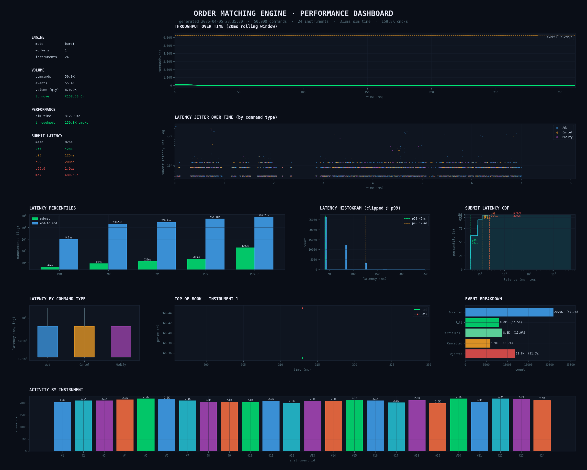
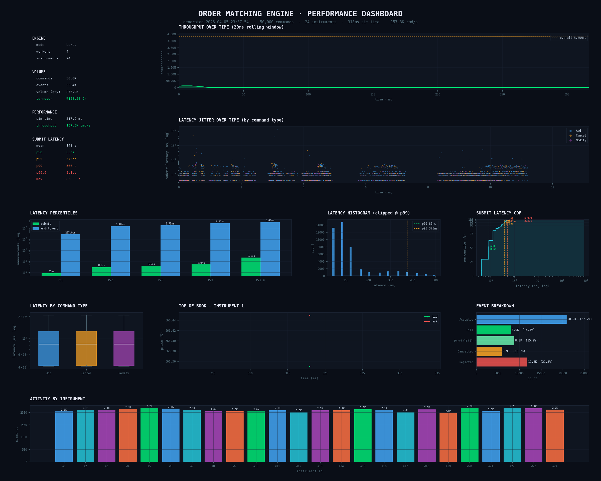

# Order Matching Engine

> A modern, low-latency C++20 order book and matching engine optimized for high-frequency trading and exchange simulation.

Built from the ground up for **sub-microsecond** order processing, this engine demonstrates production-grade techniques used by top-tier trading firms and crypto exchanges — lock-free concurrency, coroutine-based scheduling, bitmap-accelerated price discovery, and cache-friendly data structures.

---

## Table of Contents

- [Results](#results)
- [High-Level Design](#high-level-design)
- [Features](#features)
- [Architecture](#architecture)
- [Performance & Optimizations](#performance--optimizations)
- [Concurrency Model](#concurrency-model)
- [Core Concepts](#core-concepts)
- [Project Structure](#project-structure)
- [Tech Stack](#tech-stack)
- [Setup & Installation](#setup--installation)
- [Usage](#usage)
- [Future Improvements](#future-improvements)

---

## Results

### Macbook Air M2 (8 GB RAM)

#### 1. Burst workload with 1 worker



[Full benchmark report for 1 worker](./report/report_b_w1.html)

#### 2. Burst workload with 2 workers


[Full benchmark report for 2 workers](./report/report_b_w2.html)

#### 3. Burst workload with 4 workers


[Full benchmark report for 4 workers](./report/report_b_w4.html)

**_NOTE_**: A total of 24 instruments have been used as in the `instruments.cfg` file. The following configurations have been used for benchmarking:

```cmd
python3 gen_commands.py -n 50000 --duration-ms 10000 --seed 42

# w1 means 1 worker
python3 visualize.py --input sim_results.json --output-dir report
--dashboard-name dashboard_w1.png --report-name report_w1.html
```

---

## High-Level Design

You can find the detailed design here:
[Order Matching Engine HLD](https://docs.google.com/document/d/1j_P_XHgaPodja07eBl6gb003unVLGPQW8VrcwoMPjZ8/edit?usp=sharing)

## Features

| Category                | Details                                                                        |
| ----------------------- | ------------------------------------------------------------------------------ |
| **Order Types**         | Market, Limit (Stop orders partially supported in command protocol)            |
| **Time-in-Force**       | GTC (Good-Til-Canceled), IOC (Immediate-Or-Cancel), FOK (Fill-Or-Kill)         |
| **Matching Algorithm**  | Strict price-time priority (FIFO within each price level)                      |
| **Price Level Locator** | Configurable: ultra-fast `FastBook` or flexible `FlexBook`                     |
| **Concurrency**         | Lock-free SPSC ring buffers + coroutine parking (no mutexes in hot path)       |
| **Memory**              | Fixed-size order pool (up to 1M orders) with free-list allocation              |
| **Scaling**             | Coroutine workers pinned to dedicated CPU cores                                |
| **Isolation**           | Independent books per instrument with configurable price ranges and tick sizes |
| **Hot Path**            | Zero heap allocation — all structures pre-allocated and cache-line aligned     |
| **Output**              | Lock-free trade/event streaming to external callbacks                          |

---

## Architecture

The engine follows a **producer-consumer** model with clean separation between gateway submission and matching workers.

### Data Flow

```
External Gateway / Main Thread
          │
          ▼
MatchingCore::submit(Command)
          │
┌─────────────────────────────────────┐
│  Lock-free SPSC Enqueue +           │
│  Coroutine Wake (atomic handle)     │
└─────────────────────────────────────┘
          │
          ▼
┌─────────────────────────────┐
│      InstrumentContext      │
│         (per symbol)        │
├─────────────────────────────┤
│  SPSC Input Queue           │
│    (capacity: 4096 cmds)    │
│                             │
│  instrumentCoroutine()      │
│    (C++20 coroutine)        │
│                             │
│  FastBook                   │
│   ├─ OrderPool<32768>       │
│   ├─ PriceLevel[] (dense)   │
│   └─ Bid/Ask Bitmaps        │
└─────────────────────────────┘
          │
          ▼
SPSC Output Queue (1024 events)
          │
          ▼
     Drainer Thread
          │
          ▼
     TradeCallback
```

### Core Components

| Component            | Responsibility                                                       |
| -------------------- | -------------------------------------------------------------------- |
| `ArrayBitMapLocator` | Dense price array + bitmap for O(1) best price & emptiness tracking  |
| `OrderBook`          | Matching logic, price-time priority, order lifecycle                 |
| `OrderPool`          | Cache-aligned, pre-allocated order storage with free-list            |
| `InstrumentContext`  | Per-instrument isolation + coroutine state                           |
| `CoroutineWorker`    | Dedicated thread + coroutine scheduler per worker                    |
| `MatchingCore`       | Orchestration, instrument loading, drainer thread                    |
| `SPSC_RingBuffer`    | Lock-free single-producer/single-consumer queues                     |
| `OrderIndex`         | Fixed-capacity open-addressing hash map with backward shift deletion |
| `PriceLevel`         | The flat linked list node being stored in the Order Pool             |
| `RingBuffer`         | Single Producer Single Consumer queue with move semantics            |

---

## Performance & Optimizations

### ArrayBitMapLocator

Stores every possible price level in a dense contiguous `std::vector<PriceLevel>` (bids and asks). Price-to-index conversion uses simple arithmetic — `(price - minPrice) / tickSize` — giving **O(1) direct array access with perfect spatial locality**.

Maintains a **64-bit bitmap per side** (one bit per price level):

- `bestBid()` / `bestAsk()` scan from the highest/lowest word using `__builtin_clzll` / `__builtin_ctzll` — typically completing in **just a few CPU instructions**, even with thousands of price levels.
- `markNonEmpty()` / `markEmpty()` keep the bitmap perfectly synchronized, ensuring matching **never scans empty price levels**.

This completely eliminates trees (RB-tree), maps, and heaps — **no pointer chasing, no rebalancing overhead**.

---

### OrderPool

Fixed-capacity, pre-allocated array of `PoolOrder` structs (`alignas(64)`):

- **Stack-based free list** — O(1) acquire/release with zero heap allocation in the hot path.
- **Single contiguous memory block** — maximum cache-line efficiency and zero fragmentation.
- Prevents allocator jitter and false sharing under high concurrency.
- Uses an open-addressing, backward-shift deleting hash map for mapping order ids to their indices in the order pool

---

### OrderBook

Combines `ArrayBitMapLocator` + `OrderPool` into a highly optimized matching core:

- Maintains **doubly-linked lists via pool indices only** (no raw pointers) for strict FIFO time priority.
- Tracks `totalQty` per price level for **instant matching decisions**.
- Uses `std::unordered_map<OrderId, poolIndex>` for **O(1) cancel and modify operations**.

The full matching loop (`matchAggressor`) is extremely tight: bitmap → direct array access → minimal linked-list traversal only at the best price.

---

### Additional Optimizations

**Cache-Friendly Layout** — All hot structures (`PoolOrder`, `PriceLevel`, `Command`, `TradeEvent`) are 64-byte aligned.

**Zero Dynamic Allocation** — No allocations in the matching hot path. Uses memory pool + ring buffers throughout.

**Lock-Free Design** — Only atomic operations with carefully tuned memory ordering (`acq_rel`, `release`).

**Core Pinning** — Workers and drainer pinned to dedicated CPU cores, eliminating cross-core cache misses.

**Coroutines over Threads** — Efficiently handles thousands of instruments without per-instrument OS thread overhead.

---

## Concurrency Model

- **N workers** (default: `hardware_concurrency() - 2`), each pinned to a dedicated core.
- Instruments are sharded round-robin — `instrumentId % numWorkers`.
- Each instrument runs in its own **C++20 coroutine** inside a worker.
- Coroutines park via `co_await QueueAwaitable` when idle (no busy-waiting).
- Gateway wakes coroutines via atomic handle exchange + lock-free wake queue.
- Output events are drained by a separate thread to avoid blocking workers.

This design provides **excellent scalability** while maintaining deterministic low latency.

---

## Core Concepts

### Order Book

- **Bids** stored in descending price order; **Asks** in ascending.
- Each price level maintains a doubly-linked list of orders (via pool indices) for FIFO matching.
- Total quantity per level is tracked for fast matching decisions.

### Matching Algorithm

1. Aggressor order attempts to match against the opposite side's **best price**.
2. Walks price levels until the limit price or liquidity is exhausted.
3. Partial fills are supported; a full fill of a passive order removes it from the book.
4. Remaining quantity rests in the book (unless IOC, FOK or Market).

### Price-Time Priority

- Best price is matched first.
- Within the same price level, the earliest order is matched first (time priority preserved by append order).

---

## Project Structure

```sh
.
├── src/                    # Source files
│   ├── main.cpp
│   ├── MatchingCore.cpp
│   ├── CoroutineWorker.cpp
│   ├── ArrayBitMapLocator.cpp
│   ├── InstrumentConfig.cpp
│   ├── QueueAwaitable.cpp
│   ├── Threading.cpp
│   ├── ThreadPool.cpp
│   └── ...
├── include/                # Public headers
│   ├── MatchingCore.hpp
│   ├── OrderBook.hpp
│   ├── ArrayBitMapLocator.hpp
│   ├── OrderPool.hpp
│   ├── PriceLevel.hpp
│   ├── Types.hpp
│   └── ...
├── tests/                  # Unit & integration tests
├── CMakeLists.txt
└── instruments.cfg
```

---

## Tech Stack

|                  |                                                          |
| ---------------- | -------------------------------------------------------- |
| **Language**     | C++20 (coroutines, `std::variant`, `std::atomic`)        |
| **Build System** | CMake 3.20+                                              |
| **Concurrency**  | Lock-free SPSC queues, coroutines, CPU affinity          |
| **Platform**     | Linux (primary), macOS, Windows (core pinning supported) |
| **Dependencies** | None — pure STL + platform intrinsics                    |

---

## Setup & Installation

```bash
# 1. Clone the repository
git clone https://github.com/yourusername/order-matching-engine.git
cd order-matching-engine

# 2. Create build directory
mkdir build && cd build

# 3. Configure with CMake
cmake .. -DCMAKE_BUILD_TYPE=Release

# 4. Build
make -j$(nproc)
```

---

## Usage

### 1. Prepare Instruments Configuration

Create `instruments.cfg`:

```sh
# instrument_id  book_type  min_price  max_price  tick_size
1                FastBook   100000     200000     100
2                FastBook   5000       15000      50
```

### 2. Generating a Workload

```bash
python3 gen_commands.py -n 50000 --duration-ms 10000 --seed 42 \
                        --instruments instruments.cfg -o commands.csv
```

#### Options

| Flag                   | Argument | Default | Description                                                            |
| :--------------------- | :------- | :------ | :--------------------------------------------------------------------- |
| `-n`, `--num-commands` | `N`      | —       | Total number of commands to generate.                                  |
| `--duration-ms`        | `N`      | —       | Total duration the timestamps should span (used by `--realtime` mode). |
| `--seed`               | `N`      | —       | RNG seed for generating reproducible workloads.                        |
| `--instruments`        | `FILE`   | —       | Path to the instruments configuration file.                            |

### 3. Running the Simulation

```bash
# Burst mode (feed as fast as possible → measures peak throughput)
./sim_runner --commands commands.csv --instruments instruments.cfg \
             --output sim_results.json --burst --workers 2

# Realtime mode (respect timestamps; scale with --speed)
./sim_runner --commands commands.csv --realtime --speed 1.0

# Live TUI dashboard (updates every ~80ms during the run)
./sim_runner --commands commands.csv --burst --tui

# Watch a specific instrument's book, 20-level depth, 50ms snapshots
./sim_runner --commands commands.csv --burst \
             --watch 1 --depth 20 --snapshot-ms 50
```

#### Options

| Flag            | Argument | Default            | Description                                       |
| :-------------- | :------- | :----------------- | :------------------------------------------------ |
| `--commands`    | `FILE`   | `commands.csv`     | Input CSV file containing simulator instructions. |
| `--instruments` | `FILE`   | `instruments.cfg`  | Configuration file for instrument definitions.    |
| `--output`      | `FILE`   | `sim_results.json` | Destination for the final simulation results.     |
| `--burst`       | —        | —                  | **Enable** ASAP feeding for maximum throughput.   |
| `--realtime`    | —        | —                  | Enable processing based on CSV timestamps.        |
| `--speed`       | `N`      | `1.0`              | Multiplier for playback speed in realtime mode.   |
| `--snapshot-ms` | `N`      | `100`              | Book snapshot interval in ms (`0` to disable).    |
| `--depth`       | `N`      | `10`               | Number of depth levels per snapshot.              |
| `--watch`       | `ID`     | `0`                | Monitor a specific instrument ID (`0` for all).   |
| `--workers`     | `N`      | `2`                | Number of engine worker threads to spawn.         |
| `--first-core`  | `N`      | `2`                | The starting CPU core ID for thread pinning.      |
| `--tui`         | —        | —                  | Launch the live ANSI-based dashboard.             |

### 4. Report Generation

```bash
python3 visualize.py --input sim_results.json --output-dir report --dashboard-name dashboard_wn.png --report-name report_wn.html
```

---

## Future Improvements

- [x] FOK (Fill-Or-Kill) order type
- [ ] Order book snapshot & recovery persistence
- [ ] Generate Level 1 and 2 market data
- [x] Real-time visualization dashboard
- [x] Benchmark suite with nanosecond latency histograms
- [x] Improve order id to order index (in order pool) mapping
- [ ] Implement `FlexBook`
